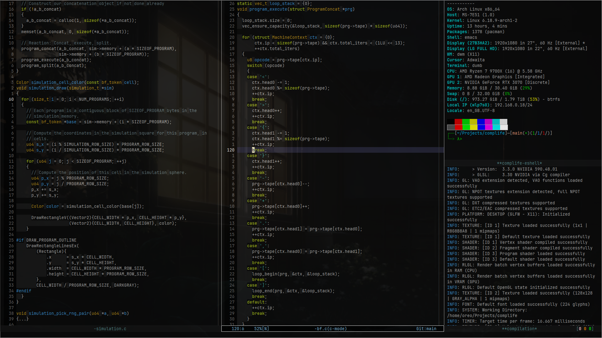

#+title: Dotfiles
#+author: Aryadev Chavali
#+description: README for Dotfiles

General configuration for my system, said system being composed of two
things:
- Emacs
- The bootstrap for Emacs

* Setup
Assumptions:
- You're on Linux
- This repository is located at =~/Dotfiles=
- You have [[https://www.gnu.org/software/stow/][GNU/stow]]

#+begin_src sh
mkdir -p \
      ~/.local/src \
      ~/.local/bin \
      ~/.local/lib \
      ~/.local/share \
      ~/.config \
      ~/Downloads \
      ~/Code \
      ~/Media \
      ~/Projects \
      ~/Text;

cd ~/Dotfiles;
stow Emacs \
     tmux \
     vim \
     Shell \
     XServer \
     Scripts \
     SystemD \
     SXHkD \
     mpv \
     aspell \
     ClangFormat \
     Dunst \
     Zathura;
#+end_src

* Why use this?
I would highly recommend AGAINST using this configuration.  It's made
for me.  If you're anything like me - in the sense of being particular
about your system - you're inevitably going to find many of the
choices I've made grating.

On the other hand, I'd say there's some pretty good work here, and I'm
very happy for you to copy anything you find interesting or useful;
I'm not a prick.  From my Emacs configuration, here are some
highlights are:

- A custom [[file:Emacs/.config/emacs/elisp/eshell-prompt.el][eshell
  prompt]] which provides git status information and a bit of dynamic
  colouring based on command exit status
- A complete [[file:Emacs/.config/emacs/elisp/literate.el][literate]]
  system which compiles my configuration
- A [[file:Emacs/.config/emacs/elisp/better-mode-line.el][better mode
  line]] based on the default mode line in an effort to make it more
  aesthetically pleasing.
- 55 line [[file:Emacs/.config/emacs/elisp/elfeed-org.el][package
  extension]] for elfeed which adds org mode support
* Emacs archives
99 Git repositories is a lot for Emacs to pull in order to setup my
configuration.  Would be nice if I could pull all of it down at once
for use instead of having to wait for _straight_ (my Emacs package
manager of choice) to do it synchronously.

These Emacs archives are an MVC (Minimum Viable Configuration)
including all the necessary Lisp which you can pull down and load
directly.  You should be able to find the latest archive
[[https://aryadevchavali.com/resources][here]].
** Scripts
*IMPORTANT*: These are heavy scripts, expect them to take a while.

If you're using Emacs and have Org >= v9.5, then these blocks can be
executed asynchronously - in which case, go ahead and evaluate them
directly (good ol ~C-c C-c~).  Otherwise, just run them in your
terminal emulator of choice.

This script generates the archive:
#+begin_src sh :async :session dotfiles-compression
tar --use-compress-program="zstdmt -19 -T0" \
    -cvf emacs-config.tar.zst \
    ~/.config/emacs/config.org \
    ~/.config/emacs/early-init.el \
    ~/.config/emacs/init.el \
    ~/.config/emacs/elisp/ \
    ~/.config/emacs/.config/custom.el \
    ~/.config/emacs/straight/versions/default.el \
    ~/.config/emacs/straight/repos/
#+end_src

And this script sends it over via rsync:
#+begin_src sh :async :session dotfiles-send-remote
rsync -avz --info=progress2 --info=name0 emacs-config.tar.zst \
      root@aryadevchavali.com:/var/www/html/resources
#+end_src
